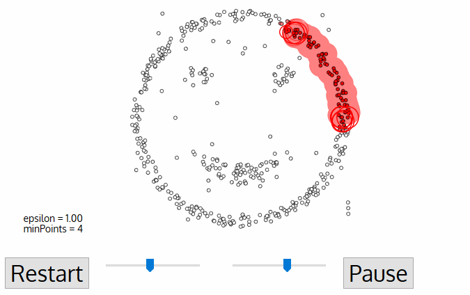

## Parameter Estimation
 
Every data mining task has the problem of parameters.Every parameter influences the algorithm in specific way.For **DBSCAN**, the parameters ε and minPts are needed.

1. **minPts** : As a rule of thumb, a minimum minPts can be derived from the number of dimensions D in the data set, as minPts ≥ D + 1. The low value minPts = 1 does not make sense, as then every point on its own will already be a cluster. With minPts ≤ 2, the result will be the same as of hierarchical clustering with the single link metric, with the dendrogram cut at height ε. Therefore, minPts must be chosen at least 3. However, larger values are usually better for data sets with noise and will yield more significant clusters. As a rule of thumb, minPts = 2·dim can be used, but it may be necessary to choose larger values for very large data, for noisy data or for data that contains many duplicates.
2. **ε** : The value for ε can then be chosen by using a k-distance graph, plotting the distance to the k = minPts-1 nearest neighbor ordered from the largest to the smallest value. Good values of ε are where this plot shows an “elbow”: if ε is chosen much too small, a large part of the data will not be clustered; whereas for a too high value of ε, clusters will merge and the majority of objects will be in the same cluster. In general, small values of ε are preferable, and as a rule of thumb, only a small fraction of points should be within this distance of each other.
3. **Distance function** : The choice of distance function is tightly linked to the choice of ε, and has a major impact on the outcomes. In general, it will be necessary to first identify a reasonable measure of similarity for the data set, before the parameter ε can be chosen. There is no estimation for this parameter, but the distance functions need to be chosen appropriately for the data set.

## Algorithm
Let X = {x1, x2, x3, …, xn} be the set of data points. DBSCAN requires two parameters: ε (eps) and the minimum number of points required to form a cluster (minPts).
1) Start with an arbitrary starting point that has not been visited.
2) Extract the neighborhood of this point using ε (All points which are within the ε distance are neighborhood).
3) If there are sufficient neighborhoods around this point then the clustering process starts and the point is marked as visited else this point is labeled as noise (Later this point can become the part of the cluster).
4) If a point is found to be a part of the cluster then its ε neighborhood is also the part of the cluster and the above procedure from step 2 is repeated for all ε neighborhood points. This is repeated until all points in the cluster is determined.
5) A new unvisited point is retrieved and processed, leading to the discovery of a further cluster or noise.
6) This process continues until all points are marked as visited.

