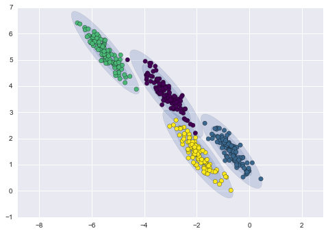
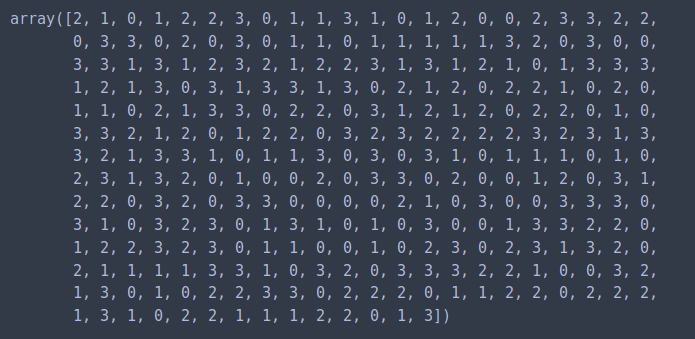
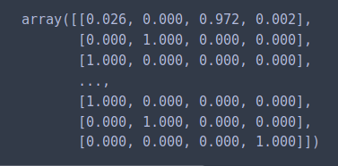
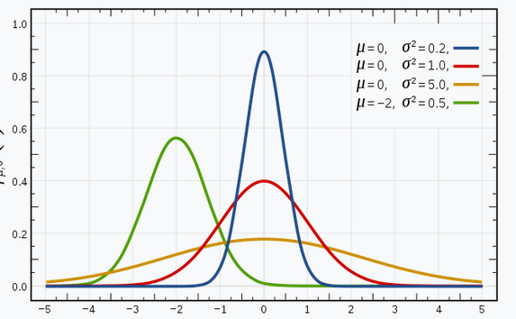
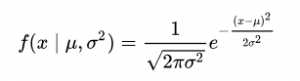
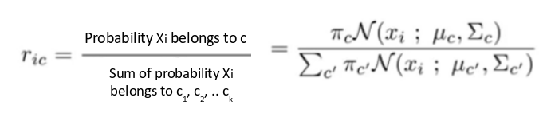
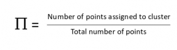
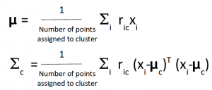

# Gaussian_Mixture Model

Gaussian mixture models can handle even very oblong clusters.

<p align="center"> 

</p>

The difference between k-means and Gaussian mixture models is that the former performs hard classification whereas the latter performs soft classification. In other words, k-means tells us what data point belong to which cluster but won’t provide us with the probabilities that a given data point belongs to each of the possible clusters.
In calling the predict function, the model will assign every data point to one of the clusters.
```
gmm.predict(X)

```
<p align="center"> 

</p>

On the other hand, we can call the predict_proba function to return the probabilities that a data point belongs to each of the K clusters.
```
gmm.predict_proba(X)
```
<p align="center"> 

</p>


## The Gaussian Distribution
I’m sure you’re familiar with Gaussian Distributions (or the Normal Distribution). It has a bell-shaped curve, with the data points symmetrically distributed around the mean value.

The below image has a few Gaussian distributions with a difference in mean (μ) and variance (σ2). Remember that the higher the σ value more would be the spread:

<p align="center"> 

</p>

In a one dimensional space, the probability density function of a Gaussian distribution is given by:

<p align="center"> 

</p>

where μ is the mean and σ2 is the variance.

Hence, for a dataset with d features, we would have a mixture of k Gaussian distributions (where k is equivalent to the number of clusters), each having a certain mean vector and variance matrix. But wait – **how is the mean and variance value for each Gaussian assigned?**

These values are determined using a technique called Expectation-Maximization (EM). We need to understand this technique before we dive deeper into the working of Gaussian Mixture Models.

### What is Expectation-Maximization?

It’s difficult to determine the right model parameters due to these missing variables. Think of it this way – if you knew which data point belongs to which cluster, you would easily be able to determine the mean vector and covariance matrix.

Since we do not have the values for the latent variables, Expectation-Maximization tries to use the existing data to determine the optimum values for these variables and then finds the model parameters. Based on these model parameters, we go back and update the values for the latent variable, and so on.


### Expectation-Maximization in Gaussian Mixture Models
Let’s understand this using another example. I want you to visualize the idea in your mind as you read along. This will help you better understand what we’re talking about.

Let’s say we need to assign k number of clusters. This means that there are k Gaussian distributions, with the mean and covariance values to be μ1, μ2, .. μk and Σ1, Σ2, .. Σk . Additionally, there is another parameter for the distribution that defines the number of points for the distribution. Or in other words, the density of the distribution is represented with Πi.

Now, we need to find the values for these parameters to define the Gaussian distributions. We already decided the number of clusters, and randomly assigned the values for the mean, covariance, and density. Next, we’ll perform the E-step and the M-step! 

### E-step:
For each point xi, calculate the probability that it belongs to cluster/distribution c1, c2, … ck. This is done using the below formula:

<p align="center"> 

</p>

### M-step:
Post the E-step, we go back and update the Π, μ and Σ values. These are updated in the following manner:

The new density is defined by the ratio of the number of points in the cluster and the total number of points:
gaussian mixture models

<p align="center"> 

</p>

The mean and the covariance matrix are updated based on the values assigned to the distribution, in proportion with the probability values for the data point. Hence, a data point that has a higher probability of being a part of that distribution will contribute a larger portion:

<p align="center"> 

</p>

Based on the updated values generated from this step, we calculate the new probabilities for each data point and update the values iteratively. This process is repeated in order to maximize the log-likelihood function. Effectively we can say that the


