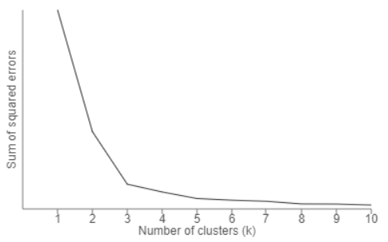

## K-Means
K-Means clustering is a type of unsupervised learning. The main goal of this algorithm to find groups in data and the number of groups is represented by K. It is an iterative procedure where each data point is assigned to one of the K groups based on feature similarity.

## Algorithm
K-Means algorithm starts with initial estimates of K centroids, which are randomly selected from the dataset. The algorithm iterates between two steps assigning data points and updating Centroids.

## Data Assignment
In this step, the data point is assigned to its nearest centroid based on the squared Euclidean distance. Let us assume a Cluster with c as centroid and a data point x is assigned to this cluster, based on the distance between c,x. There are some other distance measures like Manhattan, Jaccard, and Cosine which are used based on the appropriate type of data.

## Centroid Update
Centroids are recomputed by taking the mean of all data points assigned to a particular cluster.

## Choosing K

One method of choosing value K is the elbow method. In this method we will run K-Means clustering for a range of K values lets say ( K= 1 to 10 ) and calculate the Sum of Squared Error (SSE). SSE is calculated as the mean distance between data points and their cluster centroid.
Then plot a line chart for SSE values for each K, if the line chart looks like an arm then the elbow on the arm is the value of K that is the best.

