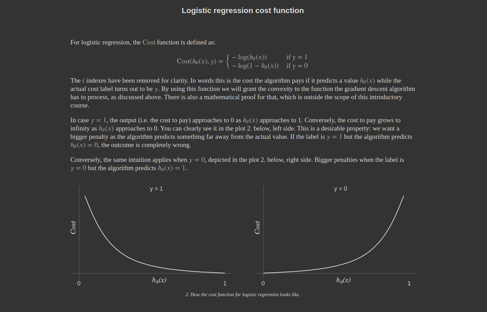
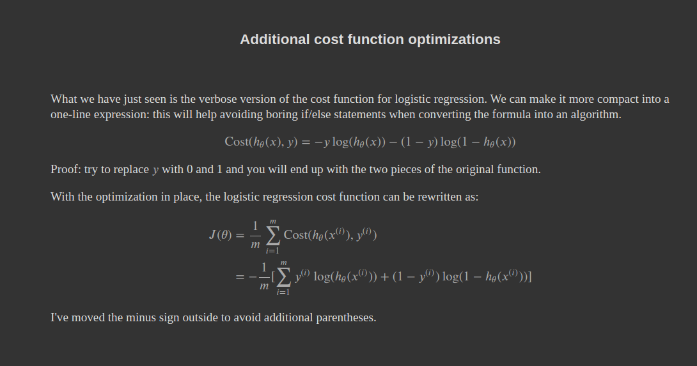

## Getting Started
Logistic Regression is basically identifying and predicting the data on binary basis. Whether it belongs to this or not(0 or 1)

I have coded the above maths in python formulas in the code

